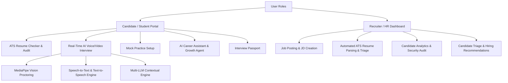

# Comprehensive Report: Autonomous AI Interviewer & HR Talent Intelligence Platform

## Executive Summary
The **Autonomous AI Interviewer & HR Talent Intelligence Platform** is an end-to-end, AI-powered recruitment and candidate preparation platform. Designed to eliminate manual resume screening bottlenecks, prevent interview fraud, and provide objective, automated candidate evaluation, the platform bridges the gap between hiring teams (Recruiters/HR) and job applicants (Candidates/Students).

Using advanced **Large Language Models (LLMs)**, **Computer Vision (MediaPipe)**, **Voice/Audio Processing**, and real-time **Proctoring Analytics**, the system delivers automated voice/video interviews, intelligent ATS (Applicant Tracking System) resume scoring, anti-cheating proctoring, personalized candidate feedback, and a verifiable candidate skill passport.

---

## Key System Architectures & Modules

---

## Detailed Feature Matrix

### 1. Candidate & Job Seeker Capabilities

#### A. Real-Time Autonomous AI Voice & Video Interview
* **Natural Conversational AI**: Interacts with candidates through dynamic spoken dialogue, asking tailored questions based on the candidate's resume, job role requirements, and live answers.
* **Interactive Dynamic Visualizer**: Provides real-time audio waveform visualizers (`AudioStreamer.jsx`, `Visualizer.jsx`) and status indicators during the speech-to-text and text-to-speech cycles.
* **Adaptive Follow-up Probe**: Generates immediate follow-up questions if candidate responses are vague, ambiguous, or incomplete.
* **Speech & Speech-to-Text (STT) Analytics**: Evaluates candidate speaking fluency, vocabulary grade, and filler-word ratio (`um`, `uh`, `like`, `you know`) in real-time.

#### B. MediaPipe Vision Anti-Cheating & Proctoring System
* **Face Identification & Identity Verification**: Matches candidate live camera feed with the application photo prior to launching the interview session.
* **Gaze & Eye-Tracking (Looking Away Detection)**: Tracks eye movements to detect when candidates look off-screen or read off external monitors/notes.
* **Multi-Face & Absence Detection**: Flags multiple faces in camera frame or sudden candidate absence.
* **Fullscreen & Tab-Switching Protection**: Detects when a candidate switches tabs, exits full-screen mode, or loses window focus, automatically logging security violations.
* **Voice Spoofing & Audio Authenticity Detector**: Monitors audio input to detect pre-recorded voice clips, synthetic TTS, or secondary speaker background interference.

#### C. ATS Resume Analyzer & Instant Audit ("ATS Scorer")
* **Multi-Dimensional Scoring Algorithm**: Evaluates resumes across 5 key pillars:
  1. **Formatting & Structure**
  2. **Font & Typography Appropriateness**
  3. **Technical Skill & Content Alignment**
  4. **Grammar & Syntax Quality**
  5. **Action-Word & Vocabulary Richness**
* **Instant Match against Job Description**: Calculates ATS match percentage against specific candidate target roles.
* **Automated Resume Fixing**: Generates an AI-optimized resume structure (JSON/Fixed Resume format) with actionable improvement suggestions.

#### D. Interactive AI Career Coach ("Resume Chatbot / Growth Agent")
* **Floating AI Assistant**: On-demand copilot for career guidance, project portfolio optimization, and interview strategy.
* **Personalized Skill Gap Remediation**: Provides targeted learning resources, article links, and customized study plans based on weak areas identified during mock or real interviews.

#### E. Verified Candidate "Interview Passport"
* **Skills Verification**: Records verified competencies based on technical evaluation performance.
* **Candidate Highlight Reels**: Consolidates clip highlights and average score ratings to enable shareable verified talent credentials.

#### F. BYOK (Bring Your Own Key) & LLM Engine Settings
* **Multi-Provider Support**: Allows users to configure their own API keys for providers including:
  * Google Gemini
  * OpenAI (GPT-4o, GPT-3.5)
  * Groq (Llama 3, Mixtral)
  * Anthropic (Claude 3.5)
  * OpenRouter & DeepSeek
  * Tavily Search (for real-time web grounding)
  * ElevenLabs (for natural voice TTS synthesis)
  * Custom OpenAI-Compatible endpoints
* **Encrypted Storage**: Encrypts and securely stores user API keys at rest.

---

### 2. Recruiter & HR Management Capabilities

#### A. Intelligent Job Posting & Custom Rules
* **JD Configuration**: HR can define required skills, nice-to-have tech stacks, experience levels, responsibilities, and custom interview questions.
* **Custom Security Rule Sets**: Configurable proctoring sensitivity per job posting (enable/disable tab switch monitoring, gaze check thresholds, liveness enforcement).
* **ATS Cut-off Thresholds**: Custom setting for minimum ATS score required before a candidate is permitted to sit for an interview.

#### B. Automated ATS Pipeline & Resume Triage
* **Bulk Candidate Parsing**: Automatically extracts text, contact info, and skill matrices from uploaded PDF/Word resumes.
* **Auto-Triage Statuses**: Automatically updates application status: `Pending ATS`, `ATS Failed`, `ATS Passed`, `Interview Scheduled`, `Interview Done`, `Hired`, `Rejected`.

#### C. Comprehensive HR Talent Analytics Dashboard
* **Candidate Deep Audit**:
  * **Interview Percentage Score & Overall Rating**
  * **Hiring Recommendation Grade** (Strong Hire, Hire, Borderline, Reject)
  * **Full Transcript Review**: Read line-by-line candidate responses and AI evaluation breakdowns.
  * **Linguistic & Communication Metrics**: Speaking fluency score, vocabulary grade, filler ratio analysis.
  * **Proctoring & Security Log**: Timestamped record of camera gaze warnings, tab switching incidents, and identity verification scores.

---

## Technical Specifications & Architecture

| Layer | Technology Stack | Description |
| :--- | :--- | :--- |
| **Frontend Framework** | React 18, Vite | High-performance single page application with modern component architecture |
| **UI Styling** | Custom CSS / Glassmorphism | Dark-mode design system with gradients, responsive layouts, and interactive state visuals |
| **Backend Framework** | Django 5.x, DRF | Robust Python REST API framework handling business logic, user auth, and DB models |
| **Real-time WebSockets** | Django Channels, ASGI | Manages live streaming proctoring events, audio frames, and live chat socket connections |
| **Computer Vision Engine** | Google MediaPipe | Client-side & server-side face landmarker and hand landmarker for real-time proctoring |
| **Audio & Speech** | Web Audio API, Canvas, STT/TTS | Audio streaming, live waveform visualizers, speech recognition, and synthetic speech output |
| **Database** | SQLite / PostgreSQL | Relational storage for Job Postings, Applications, Security Logs, User Profiles, BYOK Keys |
| **AI Orchestration** | Multi-LLM API Wrappers | Dynamic model routing across OpenAI, Gemini, Groq, DeepSeek, Anthropic, ElevenLabs |

---

## Application Workflow

1. **Job Creation (HR)**: Recruiter logs in, creates a job posting, specifies ATS threshold & proctoring rules.
2. **Application Submission (Candidate)**: Candidate applies with resume and profile photo.
3. **Automated ATS Screening**: System parses resume and computes ATS score. If above threshold, candidate moves to `ATS Passed` and unlocks the AI Interview.
4. **Pre-Interview Identity Verification**: Candidate's camera feed verifies face against application image.
5. **AI Proctored Interview**:
   - Candidate completes live voice/video interview questions.
   - Vision & voice proctoring runs continuously.
   - LLM generates context-aware follow-up questions.
6. **Report Generation & Candidate Triage**: System computes performance rating, communication score, security log report, and hiring recommendation.
7. **HR Decision**: HR views dashboard analytics, inspects proctoring warnings and transcript, and makes final `Hired` or `Rejected` decision.

---

## Summary of Key Value Propositions
* **100% Automated Candidate Screening**: Reduces HR manual resume screening time by over 80%.
* **Uncompromising Security & Proctoring**: Real-time multi-layered vision & voice fraud detection ensures candidate integrity.
* **Objective, Data-Driven Evaluation**: Eliminates bias with standardized scoring and linguistic analytics.
* **Flexible BYOK Integration**: Supports cost-efficient open-source/commercial LLMs tailored to enterprise budgets.
